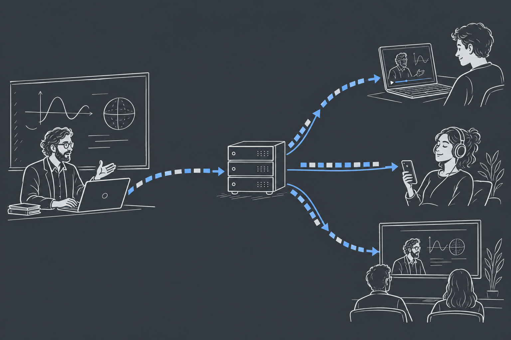

# What, Why and How

Imagine joining a live lecture from home. You hear the lecturer explain a new slide while the screen still shows the previous one. All the media may eventually arrive, yet the conversation is difficult to follow.

A live media system has to do more than deliver a file correctly. It has to keep the different parts of an experience close enough together, decide what to do when a connection slows down, and serve people who join at different times. Media over QUIC, or **MoQ**, is an approach to those problems. Throughout this book, we will use the lecture to understand how it works.

```{=html}
<figure class="editorial-illustration">

<figcaption>One lecture, several viewing experiences. The relay distributes the publication; each viewer chooses the tracks it needs. This illustration shows media flowing outward, omitting requests and transport acknowledgments.</figcaption>
</figure>
```

## What is MoQ?

MoQ is a family of work around delivering media over **QUIC**, a secure network transport that can carry several independent sequences of bytes over one connection. At its center is **MoQ Transport**, usually written **MOQT**. It defines how one endpoint makes content available and another asks to receive it. This arrangement is called **publish/subscribe**.

In our lecture, the lecturer is a **publisher**. Each viewer is a **subscriber**. The lecturer could send directly to every viewer, but that would make the lecturer's upload connection carry another copy for each person who joins. Instead, the publisher can send to a **relay**, a server that forwards the content to interested viewers.

```{mermaid}
flowchart TD
    accTitle: A lecture distributed through a relay
    accDescr: The lecturer publishes audio and video to one relay. The relay forwards audio to one viewer and audio plus video to another, according to their subscriptions.
    P[Lecturer] -->|Audio and video| R[Relay]
    R -->|Audio| A[Viewer listening on a phone]
    R -->|Audio and video| B[Viewer watching on a laptop]
```

Publisher and subscriber describe what an endpoint does with a track. They are not fixed kinds of device: a student can receive the lecture and publish microphone audio over the same session. A relay receives content upstream and publishes it downstream. See the draft’s [role definitions](https://datatracker.ietf.org/doc/html/draft-ietf-moq-transport-21#section-1.3).

To let the viewers make different choices, the publisher gives the pieces separate names. The lecturer's audio can be one **track**, camera video another, and slides a third. A track contains individually identifiable pieces of data called **objects**. For example, a media format might place one compressed video frame in each object. The phone viewer requests the audio track; the laptop viewer requests audio and video.

A relay can also **cache** objects: keep copies so it can answer later requests. Someone joining the lecture may need content published a moment earlier to begin playback. If the relay has kept that content, it can supply it without asking the lecturer to send another copy.

Although media motivates this design, an object's payload can also be application data. The transport handles names and delivery. The application and its media format agree on what the delivered bytes mean.

## How does MoQ compare with WebRTC?

WebRTC also carries live audio, video, and application data. If you have used it before, the lecture may sound like a familiar application. The main difference to understand is how much of that application each technology supplies.

Suppose a student turns on a microphone to ask a question. In a browser, WebRTC provides `RTCPeerConnection` to set up a media exchange with another endpoint. The browser integrates encoding, media transport, and receiving media. The application supplies **signaling**, the channel over which the endpoints exchange setup information, and decides who belongs in the room. The [WebRTC API specification](https://www.w3.org/TR/webrtc/) describes this browser interface.

With MoQ, the lecturer and student can each publish tracks and subscribe to one another. MOQT delivers their objects, while a media layer describes how to interpret them. That description includes the **codec**, the method used to compress and reconstruct the media, and **timestamps**, which place each piece on the media timeline. A player turns the received content into sound and pictures. A MoQ library can provide these pieces together, but they sit above the transport protocol. This division is part of the [MOQT design](https://datatracker.ietf.org/doc/html/draft-ietf-moq-transport-21#section-1).

::: {.book-table-scroll role="region" aria-label="WebRTC and MoQ comparison" tabindex="0"}

| Question | WebRTC | MoQ Transport |
| --- | --- | --- |
| What does the application work with? | A connection set up to exchange media tracks and application messages. | Named tracks of objects that receivers request. |
| How does it connect? | It checks possible network paths, including paths through a relay. | Browser applications usually connect to a server using WebTransport. |
| How does a larger audience receive it? | A media server can selectively forward streams to participants. | Relays forward requested objects and can cache them for reuse. |
| Who supplies media playback? | The browser's WebRTC media stack handles much of the pipeline. | A media library and the application supply the pipeline above MOQT. |

: WebRTC and MoQ at a glance

:::

WebRTC's connection procedure is called **ICE**. It tests possible paths between endpoints. **STUN** helps an endpoint learn how it is reachable, and **TURN** provides a server through which packets can be relayed. Together, these mechanisms help endpoints communicate across home routers and firewalls. A relay path may be selected because of network restrictions or application policy. These connectivity requirements are described in [RFC 8835, section 3.4](https://www.rfc-editor.org/rfc/rfc8835.html#section-3.4). Browser MoQ applications usually connect outward to a server through **WebTransport**, the browser interface we will explore in the next chapter.

For a conference, WebRTC can use a **selective forwarding unit**, or **SFU**. This server receives media and forwards selected streams to participants, avoiding a separate direct connection between every pair of people. An SFU selects media; a TURN server relays packets along a connection path. A MoQ relay handles named objects and subscriptions, with optional caching. Understanding those jobs is more useful than dividing systems into “peer-to-peer” and “server-based.” The [RTP topology guide](https://www.rfc-editor.org/rfc/rfc7667.html#section-3.7) describes selective forwarding.

Both WebRTC and MoQ must adapt when the network cannot carry the available media. Their eventual delay depends on encoding, routing, buffering, and implementation choices. WebRTC brings many of the pieces for a browser conversation together. MoQ makes named-content distribution a central part of its design. Either can be used for conversations or large audiences; choosing between complete implementations requires testing the experience you want to provide.

## Why another protocol?

Now suppose the lecturer produces four megabits of media each second, but one viewer's connection can carry only two. Each second adds more work to the queue. Waiting for every byte makes that viewer fall further behind the lecture.

Discarding arbitrary bytes is not a good solution either. Compressed video often describes how a picture differs from earlier pictures. If the **decoder**, the component reconstructing pictures, never receives one of those earlier pictures, later data may be unusable. To catch up, the receiver needs a place from which it can resume decoding.

MoQ gives content a structure that the distribution network can use. Objects belong to groups, and a media format can arrange those groups around useful starting points. A relay can recognize the boundaries, reuse objects requested by several viewers, and choose which work to send on each viewer's connection. It can do this without decoding the pictures. QUIC supplies separate byte streams so that unrelated content need not all wait behind the same missing bytes. These are central ideas in the draft's [motivation](https://datatracker.ietf.org/doc/html/draft-ietf-moq-transport-21#section-1.2) and [relay model](https://datatracker.ietf.org/doc/html/draft-ietf-moq-transport-21#section-7).

WebRTC also handles congestion and media adaptation. MoQ explores how to combine those delivery decisions with reusable distribution infrastructure. Our lecture might have a few people speaking and thousands listening. Speakers may need very little delay to take turns, while listeners may accept a little more buffering to avoid interruptions. The same publication can serve both, with delivery decisions made along their different paths.

## From opening a page to hearing the lecturer

When a viewer opens the lecture page, several things have to happen before sound comes out of the speakers. We will follow them through the book:

1. **Connect.** Open a transport connection and initialize a compatible MoQ session.
2. **Discover.** Find the lecture and learn which tracks it offers, unless the application already knows their names.
3. **Request.** Ask for the audio and video the viewer wants.
4. **Deliver.** Move the requested objects from the publisher, through any relays, to the viewer.
5. **Present.** Interpret the media format, reconstruct sound and pictures, and present them at the right time.

While the lecture continues, some of these activities repeat. The player may request a lower-quality video track when the connection slows, or discover a new track when the lecturer starts sharing a screen. Keeping these activities distinct helps us understand both normal playback and failures.

## A few pieces, working together

These activities involve several layers of software. The application knows about the lecture and its viewers. The media format describes the audio and video. MOQT delivers named content, and the transport underneath carries the bytes.

```{mermaid}
flowchart TD
    accTitle: The layers of a MoQ application
    accDescr: The application uses a media format, the media format uses MoQ Transport, and MoQ Transport uses QUIC directly or through WebTransport.
    A[Application: rooms and viewing choices] --> M[Media format: codecs and timestamps]
    M --> Q[MoQ Transport: names and delivery]
    Q --> T[QUIC directly or through WebTransport]
```

Suppose the viewer connects successfully but sees no picture. The connection may be working while the application requests the wrong track. Or objects may arrive correctly while the player lacks the information to decode them. Each layer gives us a separate question to investigate. We will learn the layers individually, then follow content through the whole system.

## The protocol and the project

You will encounter two related names as you read: the IETF MoQ work and the moq.dev project. The **IETF**, the Internet Engineering Task Force, develops the transport specification through public drafts. **moq.dev** provides applications and libraries, including a smaller protocol model called **moq-lite** and a media format called **hang**.

This book uses MOQT draft-21, published September 8, 2026, as its IETF baseline. It is an Internet-Draft, still being developed rather than a finished RFC. The moq.dev examples describe project documentation reviewed on September 16, 2026. We identify implementation-specific behavior as we encounter it, so you can tell which ideas belong to the transport specification and which belong to the example software. When connecting implementations, check that their protocol revisions and media formats agree.

## How to read this book

The next chapter explains QUIC and WebTransport. From there, we give content names and structure, request it, and follow it through relays to a player. The later chapters cover security, a guided experiment, and debugging.

You only need to know what a client and server are to begin reading. The optional hands-on chapter additionally assumes familiarity with a terminal, Git, and a development environment. We will introduce the networking and media concepts along the way, using the lecture as our running example. The [glossary](/docs/12-glossary/) can help if a term interrupts your reading, and each chapter links to the specifications behind its explanations.


## Sources and further reading {.unnumbered #sources}

- [MOQT draft-21: introduction](https://datatracker.ietf.org/doc/html/draft-ietf-moq-transport-21#section-1)
- [moq.dev: concepts](https://doc.moq.dev/concept/)
- [W3C: WebRTC browser API](https://www.w3.org/TR/webrtc/)
- [RFC 8835: WebRTC connectivity and transports](https://www.rfc-editor.org/rfc/rfc8835.html)
- [RFC 7667: selective forwarding topology](https://www.rfc-editor.org/rfc/rfc7667.html#section-3.7)
