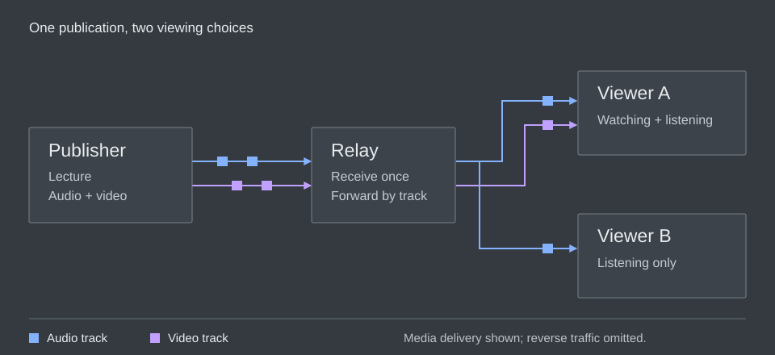

# What, Why and How

Imagine joining a live lecture from home. You hear the lecturer explain a new slide while the screen still shows the previous one. All the media may eventually arrive, yet the conversation is difficult to follow.

A live media system has to do more than deliver a file correctly. It has to keep the different parts of an experience close enough together, decide what to do when a connection slows down, and serve people who join at different times. Media over QUIC, or **MoQ**, is an approach to those problems. Throughout this book, we will use the lecture to understand how it works.

```{=html}
<figure class="editorial-illustration">

<figcaption>The relay receives the publication once and forwards the tracks each viewer requests. Blue is audio; purple is video. Requests and transport acknowledgments are omitted.</figcaption>
</figure>
```

## What is MoQ?

MoQ is a family of work around delivering media over **QUIC**, a secure network transport that can carry several independent sequences of bytes over one connection. At its center is **MoQ Transport**, usually written **MOQT**. It defines how one endpoint makes content available and another asks to receive it. This arrangement is called **publish/subscribe**.

In our lecture, the lecturer is a **publisher**. Each viewer is a **subscriber**. The lecturer could send directly to every viewer, but that would make the lecturer's upload connection carry another copy for each person who joins. Instead, the publisher can send to a **relay**, a server that forwards the content to interested viewers.

```{mermaid}
flowchart TD
    accTitle: A lecture distributed through a relay
    accDescr: The lecturer publishes audio and video to one relay. The relay forwards audio to one viewer and audio plus video to another, according to their subscriptions.
    P[Lecturer] -->|Audio and video| R[Relay]
    R -->|Audio| A[Viewer listening on a phone]
    R -->|Audio and video| B[Viewer watching on a laptop]
```

Publisher and subscriber describe what an endpoint does with a track. They are not fixed kinds of device: a student can receive the lecture and publish microphone audio over the same session. A relay receives content upstream and publishes it downstream. See the draft’s [role definitions](https://datatracker.ietf.org/doc/html/draft-ietf-moq-transport-21#section-1.3).

To let the viewers make different choices, the publisher gives the pieces separate names. The lecturer's audio can be one **track**, camera video another, and slides a third. A track contains individually identifiable pieces of data called **objects**. For example, a media format might place one compressed video frame in each object. The phone viewer requests the audio track; the laptop viewer requests audio and video.

A relay can also **cache** objects: keep copies so it can answer later requests. Someone joining the lecture may need content published a moment earlier to begin playback. If the relay has kept that content, it can supply it without asking the lecturer to send another copy.

Although media motivates this design, an object's payload can also be application data. The transport handles names and delivery. The application and its media format agree on what the delivered bytes mean.

## How does MoQ compare with WebRTC?

WebRTC and MoQ can both carry a live conversation or a broadcast. They organize the work differently. WebRTC gives a browser an integrated media connection; MOQT gives applications a way to publish and request named content. Comparing them starts with what your application needs to build around that foundation.

### What the browser does for you

For a video call, the browser's WebRTC stack handles encoding, media transport, receiving, and decoding. The application uses `RTCPeerConnection`, supplies **signaling** to exchange setup information, and decides who joins the room. Capturing a microphone and attaching received media to a player still require application code. See the [WebRTC API](https://www.w3.org/TR/webrtc/).

MOQT itself supplies no camera API, codec, or player. It delivers objects. A MoQ media library must describe those objects, encode and decode media, and arrange playback. The library can hide much of this work, but its capabilities are separate from what the transport specification guarantees. That separation lets a relay forward the same named content without understanding its codec. See the [MOQT object model](https://datatracker.ietf.org/doc/html/draft-ietf-moq-transport-21#section-2).

### How content reaches people

WebRTC uses **ICE** to find a working path between endpoints. **STUN** helps discover reachable addresses; **TURN** supplies a relay path when needed. In a group call, a **selective forwarding unit**, or **SFU**, can receive each participant's media and forward selected streams to others. An SFU handles media distribution; a TURN server relays traffic along a connection path. These are different jobs. See [RFC 8835 §3.4](https://www.rfc-editor.org/rfc/rfc8835.html#section-3.4) and [RFC 7667 §3.7](https://www.rfc-editor.org/rfc/rfc7667.html#section-3.7).

A browser MoQ client normally opens an outgoing WebTransport connection to a server. MoQ relays distribute requested tracks and can retain objects for later requests. For our lecture, that means a relay can forward the current audio while supplying a newly arrived viewer with earlier video needed to begin decoding. Caching is an explicit part of MOQT's [relay model](https://datatracker.ietf.org/doc/html/draft-ietf-moq-transport-21#section-7); retaining enough useful content remains an implementation decision.

::: {.book-table-scroll role="region" aria-label="WebRTC and MoQ comparison" tabindex="0"}

| Requirement | What WebRTC supplies | What to check in a MoQ system |
| --- | --- | --- |
| A browser voice or video call | An integrated browser media stack and connectivity procedure | Capture, codecs, playback, echo handling, and connectivity in the chosen library |
| A large live audience | Media forwarding through servers such as SFUs | Relay fan-out, track selection, and actual capacity under load |
| Joining from a recent starting point | Application or media-server behavior around the live stream | Retained objects, a usable decoding point, and a way to request them |
| Direct connections across home networks | ICE, STUN, and TURN support | The implementation's connection model; MOQT does not define an ICE replacement |
| A predictable deployment | Interoperability across the browsers and services you target | Matching MOQT revisions, media formats, browser APIs, and fallback behavior |

: Questions to ask when choosing an implementation

:::

Neither protocol name tells you the final delay, operating cost, or audience limit. Those depend on the encoder, topology, buffering, available bandwidth, and software. QUIC's streams help organize delivery, but they do not eliminate congestion. WebRTC's integrated media stack does not restrict it to small calls. MoQ's distribution model does not restrict it to broadcasts.

### They can work together

An existing WebRTC publisher can feed a gateway that publishes the content over MoQ. The gateway has to translate media packaging and session behavior; replacing a socket is not enough. Lorenzo Miniero's [Meetecho interoperability demo](https://www.meetecho.com/blog/moq-webrtc/) shows one such bridge. That 2024 article uses older drafts, so use it to understand the architecture rather than today's message formats.

For a practical evaluation, start with one complete path: a speaker, a relay or media server, and a viewer on a constrained connection. Measure join time, conversational delay, stalls, and recovery. Then increase the audience. [Cloudflare's account of its MoQ work](https://blog.cloudflare.com/moq/) explains the distribution motivation from an operator's perspective; the [webrtcHacks use-case comparison](https://webrtchacks.com/webrtc-vs-moq-by-use-case/) offers another author's assessment of the tradeoffs. These are useful implementation perspectives, not performance guarantees from a standard.

## Why another protocol?

Now suppose the lecturer produces four megabits of media each second, but one viewer's connection can carry only two. Each second adds more work to the queue. Waiting for every byte makes that viewer fall further behind the lecture.

Discarding arbitrary bytes is not a good solution either. Compressed video often describes how a picture differs from earlier pictures. If the **decoder**, the component reconstructing pictures, never receives one of those earlier pictures, later data may be unusable. To catch up, the receiver needs a place from which it can resume decoding.

MoQ gives content a structure that the distribution network can use. Objects belong to groups, and a media format can arrange those groups around useful starting points. A relay can recognize the boundaries, reuse objects requested by several viewers, and choose which work to send on each viewer's connection. It can do this without decoding the pictures. QUIC supplies separate byte streams so that unrelated content need not all wait behind the same missing bytes. These are central ideas in the draft's [motivation](https://datatracker.ietf.org/doc/html/draft-ietf-moq-transport-21#section-1.2) and [relay model](https://datatracker.ietf.org/doc/html/draft-ietf-moq-transport-21#section-7).

WebRTC also handles congestion and media adaptation. MoQ explores how to combine those delivery decisions with reusable distribution infrastructure. Our lecture might have a few people speaking and thousands listening. Speakers may need very little delay to take turns, while listeners may accept a little more buffering to avoid interruptions. The same publication can serve both, with delivery decisions made along their different paths.

## From opening a page to hearing the lecturer

When a viewer opens the lecture page, several things have to happen before sound comes out of the speakers. We will follow them through the book:

1. **Connect.** Open a transport connection and initialize a compatible MoQ session.
2. **Discover.** Find the lecture and learn which tracks it offers, unless the application already knows their names.
3. **Request.** Ask for the audio and video the viewer wants.
4. **Deliver.** Move the requested objects from the publisher, through any relays, to the viewer.
5. **Present.** Interpret the media format, reconstruct sound and pictures, and present them at the right time.

While the lecture continues, some of these activities repeat. The player may request a lower-quality video track when the connection slows, or discover a new track when the lecturer starts sharing a screen. Keeping these activities distinct helps us understand both normal playback and failures.

## A few pieces, working together

These activities involve several layers of software. The application knows about the lecture and its viewers. The media format describes the audio and video. MOQT delivers named content, and the transport underneath carries the bytes.

```{mermaid}
flowchart TD
    accTitle: The layers of a MoQ application
    accDescr: The application uses a media format, the media format uses MoQ Transport, and MoQ Transport uses QUIC directly or through WebTransport.
    A[Application: rooms and viewing choices] --> M[Media format: codecs and timestamps]
    M --> Q[MoQ Transport: names and delivery]
    Q --> T[QUIC directly or through WebTransport]
```

Suppose the viewer connects successfully but sees no picture. The connection may be working while the application requests the wrong track. Or objects may arrive correctly while the player lacks the information to decode them. Each layer gives us a separate question to investigate. We will learn the layers individually, then follow content through the whole system.

## The protocol and the project

You will encounter two related names as you read: the IETF MoQ work and the moq.dev project. The **IETF**, the Internet Engineering Task Force, develops the transport specification through public drafts. **moq.dev** provides applications and libraries, including a smaller protocol model called **moq-lite** and a media format called **hang**.

This book uses MOQT draft-21, published September 8, 2026, as its IETF baseline. It is an Internet-Draft, still being developed rather than a finished RFC. The moq.dev examples describe project documentation reviewed on September 16, 2026. We identify implementation-specific behavior as we encounter it, so you can tell which ideas belong to the transport specification and which belong to the example software. When connecting implementations, check that their protocol revisions and media formats agree.

## How to read this book

The next chapter explains QUIC and WebTransport. From there, we give content names and structure, request it, and follow it through relays to a player. The later chapters cover security, a guided experiment, and debugging.

You only need to know what a client and server are to begin reading. The optional hands-on chapter additionally assumes familiarity with a terminal, Git, and a development environment. We will introduce the networking and media concepts along the way, using the lecture as our running example. The [glossary](/docs/12-glossary/) can help if a term interrupts your reading, and each chapter links to the specifications behind its explanations.


## Sources and further reading {.unnumbered #sources}

- [MOQT draft-21: introduction](https://datatracker.ietf.org/doc/html/draft-ietf-moq-transport-21#section-1)
- [moq.dev: concepts](https://doc.moq.dev/concept/)
- [W3C: WebRTC browser API](https://www.w3.org/TR/webrtc/)
- [RFC 8835: WebRTC connectivity and transports](https://www.rfc-editor.org/rfc/rfc8835.html)
- [RFC 7667: selective forwarding topology](https://www.rfc-editor.org/rfc/rfc7667.html#section-3.7)
